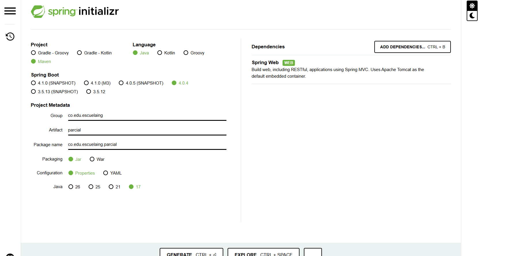
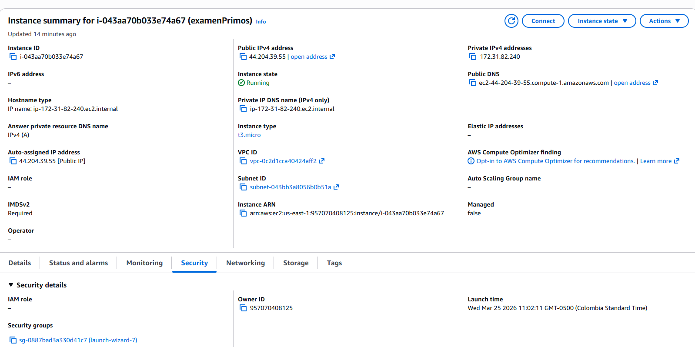
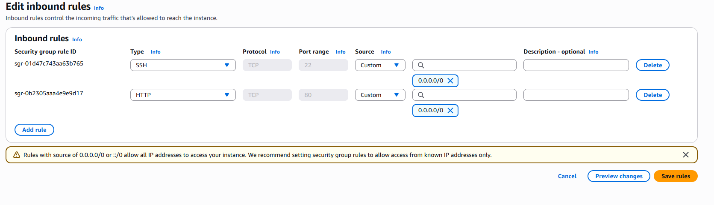
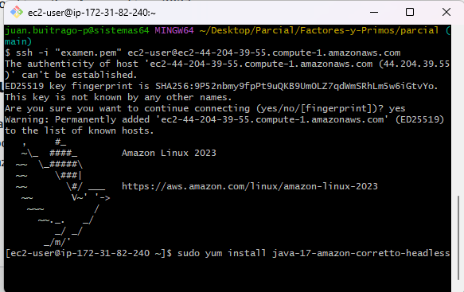
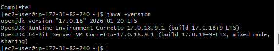
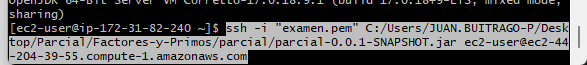

# Parcial
# Implementacion del Problema
Se inicio el proyecto con spring y se agregaron las dependencias para poder hacer peticiones HTTP GET

# Lanzamiento de la Instancia EC2
Se creo la instancia para subir posteriormente el codigo con el .jar que genera el proyecto maven

Se modificaron las reglas  

Luego entramos por ssh desde una terminal Git Bash y se instalo java para que pudiera correr el codigo previamente hecho

Ahora subimos el archivo .jar por medio de scp

### Juan Sebastian Buitrago Piñeros